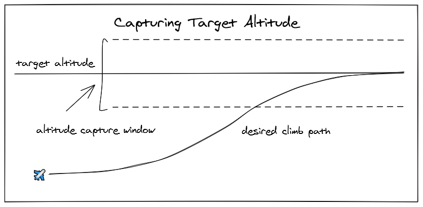
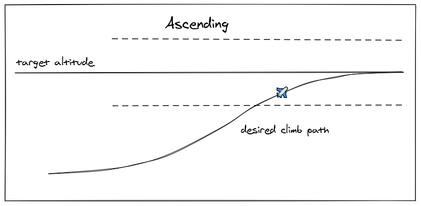
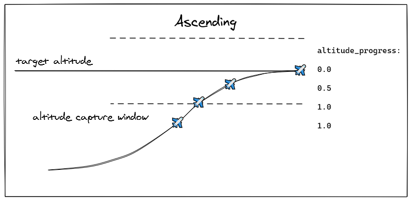
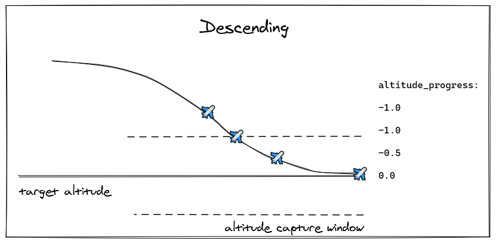
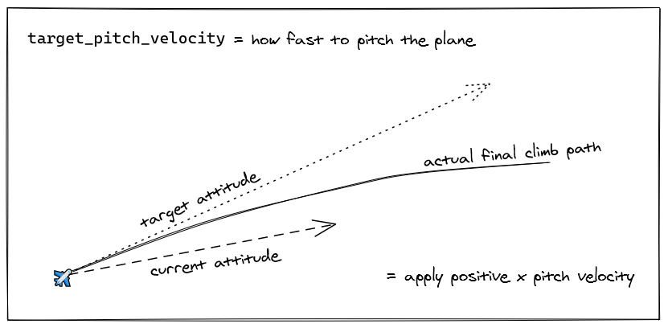
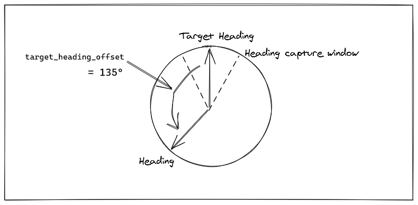
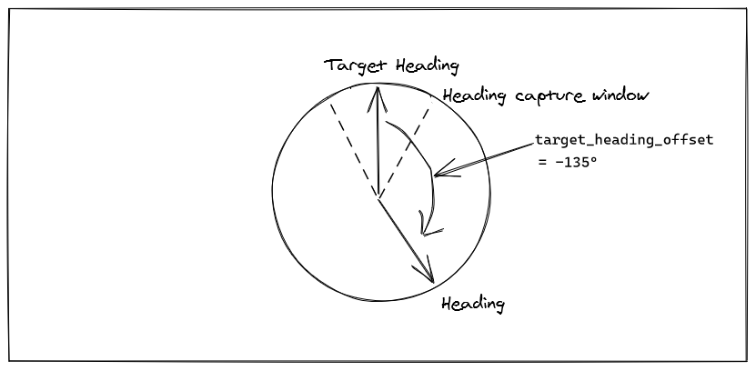
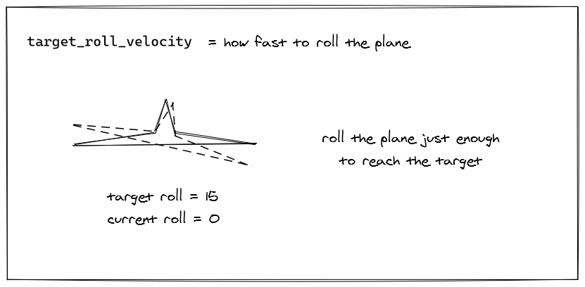

# samp-aviation

A basic pitch-based altitude and roll-based heading autopilot for SA-MP.

Based on real autopilot behaviour with some adjustments made for the simple physics of San Andreas.

## How does it work?

The AP takes a bunch of variables that describe the aircraft's current orientation and speed. It then uses these to calculate a set of angular velocities required to nudge the plane towards its target. This process just repeats, constantly correcting for changes and re-adjusting the aircraft's orientation until it has reached the target altitude and heading. It then maintains these with constant small adjustments.

### Part 1: Altitude

One of the jobs of most autopilots undertake is to climb to, descend to and maintain a target altitude.

How this is achieved is by having a _climb path_ which is essentially a change in altitude via pitch and throttle inputs. In this game, we can't directly control the throttle of a vehicle so we will focus on the pitch. This unfortunately means that FLC (Flight Level Control) is not possible. We will instead focus on a very simple pitch-based altitude system. There's no vertical speed based autopilot currently implemented. It simply climbs at whatever vertical speed is necessary.

But the plane can't just go up until it hits the magic number because it will overshoot and then have to descend. It will do this for eternity as every time the plane achieves the target altitude, it will be travelling too fast up or down to stop in time. So, to solve this there is a _capture window_ which is a range around the target altitude.

The goal is to slow the rate of ascent once the aircraft enters the capture window. And of course if the aircraft is _descending_ when we slow the rate of descent instead. The same logic applies to both directions.

So, this is done by introducing a new value named `altitude_progress`. This is a value between `-1.0 `and `1.0` which describes how close to the target altitude the aircraft is. Outside of the capture window, the value is always at a constant `-1.0` for above or `1.0` for below the target altitude. Once the aircraft enters the altitude capture window, the `altitude_progress` value ramps down linearly towards zero. This means if the aircraft is exactly half way between the capture window and the target altitude, `altitude_progress` is equal to `0.5`.

And the same is true for descent except the `altitude_progress` value uses negative values. Any altitude outside of the capture window above the target altitude is `-1.0`. If the aircraft is half way through the capture window, it's `-0.5`.

So what's this number used for? It's a value between `-1.0` and `1.0` and when `0.0` that indicates the aircraft is _at_ the target altitude. If the value is negative, that indicates the aircraft needs to descend and if it's positive, that means the aircraft must climb. How is this number useful then?

Well, we can use it to tell the aircraft what pitch it should be. If the value is positive, that means the aircraft is below the target altitude and needs to ascend, so this maps to a desired pitch of 15 degrees. If it's half way through the capture window, pitch should be half that as the plane is approaching the target and needs to slow its climb. The same applies for negatives and descent: `-1.0` is `-15` degrees, `-0.5` is `-7.5` degrees, etc. This is just a simple linear interpolation.

So now we have a new value: `target_attitude` (attitude is another word for pitch, not to be confused with altitude!) and this value can be calculated very simply using the `target_altitude` value. It's just a simple multiplication of 15 degrees with the `target_altitude` value. So if `target_altitude` is 1.0, the target attitude is 15, if it's -1.0 it's -15 and everything in between.

So we have a "target attitude". Which means we also have an "attitude progress" value too. Just like "altitude progress" this is a value between `-1.0` and `1.0` that indicates how close to the target attitude the aircraft is. This value is then used to drive the `target_pitch_velocity` which is one step closer to how we can actually control the aircraft. As with the other target and progress values, if the aircraft is below the target attitude, it needs positive pitch to achieve its target attitude.

And similarly, negative pitch if the aircraft is above its target attitude. And this target attitude is re-evaluated constantly so a good way to visualise it is thinking of the target attitude as a line tangential to the actual final climb path.

So what is `target_pitch_velocity` anyway? It's an _angular velocity_ which is effectively a value used to "nudge" the aircraft in terms of rotation. We don't have direct access to the plane's elevators, ailerons or rudder so instead, we use `SetVehicleAngularVelocity` to force the aircraft to rotate. This is why all this calculation is required to get a very small angular velocity to nudge the plane by.

Another thing to take into consideration is the fact that the plane doesn't always need to rotate at the same speed. If the current attitude is very close to the target, the rotation that needs to be applied is very small. Because of this, the `attitude_progress` value is used to scale the actual angular velocity so small progress values mean small adjustments. This results in a very smooth flight.

### Part 2: Heading

Heading involves a similar process. The plane is flying at some current heading, and the autopilot has a target heading that it must achieve by maneuvering the aircraft.

Similarly, there's also a capture window. This helps the autopilot slow down its adjustments once it gets close to the target. There is a slight complication here though: angles are in the range 0-360 and if your target is 359, what should the upper bound of the window be? 14 degrees? 374 degrees? Because of these edge cases around where the range wraps around, the autopilot code works in relative terms instead.

What this means is instead of treating the compass as a static space in which the aircraft rotates around, instead it treats the aircraft as a static space with the target rotating freely around it (Note how there are no north/south/east/west markers on these compass diagrams). To achieve this, the first value to calculate is the `target_heading_offset` which is a value between `-180` and `180` and describes two things: how far the aircraft is from the target and which direction the target is in. If the value is `90` then we know the target is a right angle to the left. (remember! GTA:SA angles are reversed!) As the aircraft turns towards the target, the `target_heading_offset` simply gets smaller.

And, again, just in case you forgot again, GTA:SA inverts the compass so East is at _negative_ 90 degrees (also known as 270 degrees) and left turns are what increase your heading, not right turns. Confusing? Yes. Why? No idea. Find someone at Rockstar and ask them...

So, exactly as with pitch, we have a "progress" value which is clamped to the `-1.0`-`1.0` range and indicates how close the aircraft is to the target. Anywhere outside of the capture window is a flat negative or positive `1.0` value where the sign indicates direction (negative for right, positive for left) and values between the edge of the capture window and the target smoothly ramp down to zero.

And, again, similar to pitch, that progress value is used to calculate a target roll. This is the ideal roll angle that the plane must be in to bank towards the target. It's simply the progress value multiplied by the maximum roll angle - typically 15 degrees for most general aviation aircraft excluding fighter jets.

So if the heading progress is 1.0, the plane is to the left of the target and needs to turn right so the target roll is 15 degrees.

As the aircraft enters the heading capture window and slowly ramps down to zero, the roll angle ramps down with it. `0.5` progress means `7.5` roll angle. You get the idea.

And finally, we need an actual angular velocity to apply so the target roll is used to calculate a roll progress which is then used to calculate a target roll velocity which is then used to nudge the plane in the right direction.

## Footnotes

### Beautifully Simple Physics

The game is actually quite a nice sim for vehicle physics. Newer games try to "protect" the player by nudging vehicles in certain directions, preventing flips, helping you avoid crashes, etc. These are all game design decisions to make for a more enjoyable experience when the focus is not entirely on driving or flying. But San Andreas has a beautifully simple physics sim that just gets out of your way and lets you make mistakes if you want. The result of this is the plane physics are actually quite "bare bones" and are a perfect canvas to experiment with things like this.

Planes have natural lift when accelerating, they roll rather freely and lose altitude when doing so, landing gear also drops flaps which slows the plane and provides some lift too! I have a feeling someone on the team was either an aviation nerd or just did good research.

### Rudder

One thing the game unfortunately does not do is simulate rudders correctly. When you rudder left or right, the plane just magically rotates. So I've mostly avoided using yaw in the AP but heading adjustments do use a tiny bit of yaw to help make turns faster.

### Vertical Speed

I did attempt a proper vertical speed based autopilot but the unit scaling in the game leads to a very erratic velocity calculation which oscillates a lot and causes a ton of hunting for the correct pitch angle to satisfy the target vertical speed. Because of this, I just abandoned the idea and stuck with the simple pitch-based AP.

### No Takeover Control

In a real (GA) aircraft, the AP controls the trim wheels with servo motors. This means the pilot can, at any time, provide their own inputs on top of the AP to nudge it, correct small mistakes, take over manually during an emergency, etc. Unfortunately, the game does not provide a means of simply _adding_ angular velocity to the current value, only _setting_ the angular velocity, overwriting any input the player had. As a result, the player cannot really control the plane (they can a tiny bit, but the AP just fights back as its inputs are much faster) and must disengage the AP to regain full control.

### Turbulence

There's a tiny bit of turbulence added for fun. It's not elaborate, just some random variations in orientation applied as well as some small nudges in velocity. This could eventually become a full wind simulation.
